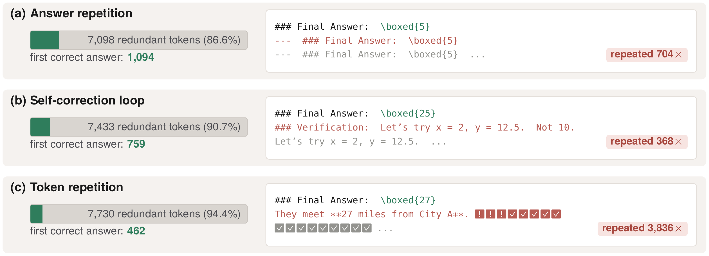
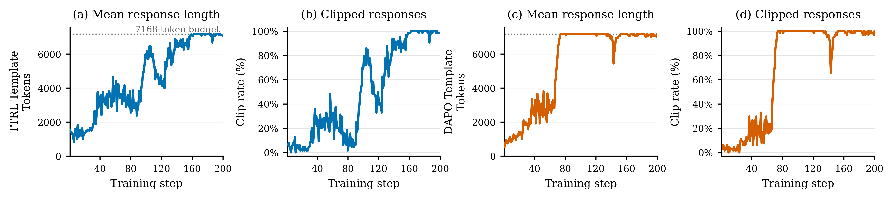
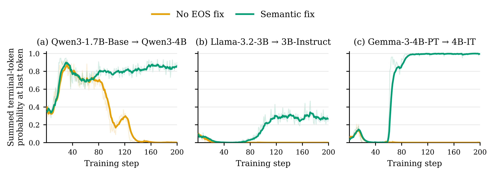
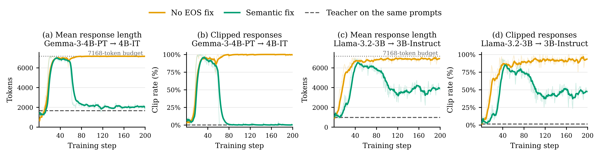

<div align="center">

# OPD Length Inflation

**Why on-policy distillation stops terminating — and how to fix it**

Research code for the phenomenon, its mechanism, and a terminal-token fix,
reproduced across four student → teacher pairs.

</div>

---

## Why this matters

On-policy distillation scores the student's **own** rollouts token-by-token with a teacher. That
is what makes it sample-efficient — and it is also what makes a detail nobody checks in offline
distillation load-bearing: the teacher's scores only mean anything at states the student
actually visits.

Here is what goes wrong when one of those details is off. The student solves the problem, and
then cannot stop:

<div align="center">
  
</div>

Each of these rollouts is **correct**. The first one reaches `\boxed{5}` at token 1094 and then
emits the same "### Final Answer" line 704 more times; the last reaches `\boxed{27}` at token
462 and then spends **94% of its 8192-token budget** on repeated punctuation. The answer is
right, the grade is right, and almost the entire generation is waste.

This is not a tail of unlucky samples — it is where training converges. Over 200 updates the
mean response length climbs into the token budget and the fraction of clipped (never-terminated)
responses reaches ~100%, under both prompt templates:

<div align="center">
  
</div>

### What actually breaks

Measure the one quantity the symptom is about: at the position where the student *did* stop, how
much probability does it put on stopping — summed over every terminal token of that pair. Without
the fix (orange) it goes to zero, on all three pairs:

<div align="center">
  
</div>

Qwen is the clearest: the student first *learns* to terminate, reaching ~0.87 around step 35, and
then unlearns it — by step 150 its probability of stopping where it stopped is indistinguishable
from zero, which is exactly when length saturates the budget above. Llama and Gemma never get
there at all. This is not a model that fails to pick up termination; it is a model actively
trained out of it.

### Why

A base student treats one token as terminal. Its post-trained teacher ends assistant turns on a
**different** one — `<|endoftext|>` vs `<|im_end|>` for Qwen, one terminal id against three for
Llama. The teacher is confident that the turn is over, but it puts that confidence on a token the
base student's decoder can never sample, so it never appears in a rollout and never receives
gradient. Meanwhile the token the student *can* emit gets no support from the teacher. Terminating
is an action the objective cannot reward, and continuing is the only thing left.

The green curves are the test of that explanation. They are the same data, the same models, the
same batch size and the same budget — the single change is that the student's and the teacher's
terminal tokens are scored as **one semantic stop action** instead of as unrelated tokens. The
collapse disappears.

### The fix

That change is `EOS_MODE=semantic_class`: one terminal class, scored with the teacher's summed
terminal mass, so termination becomes learnable again. The length inflation reverses with it —
responses collapse back toward the teacher's own length and clipping largely disappears:

<div align="center">
  
</div>

Gemma goes from saturating the 7168-token budget at a ~100% clip rate to a mean of roughly 2000
tokens — close to the teacher's own median on the same prompts — with clipping near zero. Llama
comes down to ~3500–4000 tokens and roughly halves its clip rate. Rollouts stop because the model
decided to stop, not because the budget ran out, and that is most of the wall-clock and most of
the token spend of an OPD run.

The diagnosis is what transfers: length inflation under OPD is worth checking against
student/teacher terminal-token alignment before it is attributed to the objective, the data or
the horizon.

---

## What is in here

Four student → teacher pairs, one shared training launcher and one shared evaluator, so that
every comparison changes exactly one thing:

| Pair | Student | Teacher | Terminal sets | Updates |
|---|---|---|---|---:|
| **Qwen** | `Qwen/Qwen3-1.7B-Base` | `Qwen/Qwen3-4B` | misaligned — 1 id vs 2 | 200 |
| **Llama** | `meta-llama/Llama-3.2-3B` | `meta-llama/Llama-3.2-3B-Instruct` | misaligned — 1 id vs 3 | 200 |
| **Gemma** | `google/gemma-3-4b-pt` | `google/gemma-3-4b-it` | **already aligned** — isolates the loss | 200 |
| **K2** | `IFM/K2-Horizon-7B@pretrain_final` | `IFM/K2-Horizon-7B@main` | misaligned, ~9B each | **400** |

Fixed everywhere: TTRL prompts from DAPO-Math-17k, batch size 16, rollout `n=4`, prompt 1024 +
response 7168, lr 1e-6, temperature 1.0, sampled-token OPD (`log_prob_top_k=0`), a checkpoint
every 20 updates, in-training validation off. Only the models and the EOS interpretation change.

Two secondary axes ride on the same launcher: **prompt template** (TTRL / DAPO / raw-question,
each evaluated under the template recorded in its own run, so template and EOS are never varied
together) and **horizon** (the K2 headline pair runs 400 updates instead of 200; everything
else, including the K2 stage controls, runs 200).

Built on [verl](https://github.com/verl-project/verl) (vendored, patched), with an evaluation
harness derived from [JustRL](https://github.com/thunlp/JustRL).

> [!NOTE]
> Ships **code, scripts and prompt data only** — no checkpoints, W&B logs or eval outputs. Every
> entrypoint writes under the working directory; nothing is hard-coded to a cluster or account.

---

## Setup

4 GPUs and Slurm. A stack that passes both train and eval smoke tests:

```bash
conda create -n opd-length-inflation python=3.12 -y && conda activate opd-length-inflation
python -m pip install torch==2.8.0 --index-url https://download.pytorch.org/whl/cu128
python -m pip install "vllm==0.11.0" "transformers==4.55.4" "ray==2.54.0" \
                      "wandb==0.28.0" "flashinfer-python==0.3.1" math-verify
python -m pip install -e ./verl
```

If your cluster already has a working verl/vLLM environment, use that instead and pass
`CONDA_ENV=/path/to/env`; otherwise activate it before `sbatch`.

`#SBATCH` headers request a GPU **count** only and name no partition, so jobs land on your
default partition. Override with `sbatch` flags or `SBATCH_PARTITION` / `SBATCH_GRES` /
`SBATCH_ACCOUNT`. Authenticate first — Llama 3.2 and Gemma 3 are gated, and W&B defaults to
online:

```bash
hf auth login && wandb login      # or export WANDB_MODE=offline
```

Prompt streams and benchmarks ship with the repository (`datasets/`, `scripts/val/data/`); the
two derived train templates are regenerable with `scripts/data/prepare_dapo_ttrl.py`.

---

## Reproducing the experiments

Every entrypoint takes **`DRY_RUN=true`**, which resolves and prints the whole configuration
without allocating a GPU. Run that first. Submit from the repository root.

### Train

The five EOS conditions differ only in how terminal tokens are interpreted. `e1` is the
student's native EOS; `e2` is the teacher's turn-end token, which the baseline student can never
stop on.

| Condition | Entrypoint (`slurm/train/`) | Stop ids | Blocked | Loss change |
|---|---|---|---|---|
| **A** baseline | `train_ttrl_eos_a_baseline_200step.sl` | `e1` | — | none |
| **B** two-stop | `train_ttrl_eos_b_two_stop_200step.sl` | `e1, e2` | — | none; the student may now *stop* on `e2` |
| **C** teacher-map | `train_ttrl_eos_c_teacher_map_200step.sl` | `e1` | — | teacher termination mass mapped onto `e1` |
| **D** semantic-class | `train_ttrl_eos_d_semantic_class_200step.sl` | `e1, e2` | — | **the fix** — both aggregated into one action |
| **E** canonical | `train_ttrl_eos_e_canonical_200step.sl` | `e1` | `e2` | map the mass, mask `e2`, renormalise |

```bash
DRY_RUN=true bash slurm/submit_ttrl_eos_sweep.sh   # print the plan: 5 trains + 5 chained evals
bash slurm/submit_ttrl_eos_sweep.sh                # each eval chains on afterok:<train-job-id>
```

**A** and **B** are the negative controls. Template baselines are the same launcher with a
different prompt stream: `train_dapo_baseline_200step.sl` and `train_eopd_baseline_200step.sl`.

**Llama and Gemma** use the same settings; only the models and the EOS mode change. Terminal ids
are discovered at submit time — no token id is hard-coded anywhere:

```bash
bash slurm/submit_multimodel_runs.sh                          # llama,gemma × baseline,semantic_class
MODELS=gemma EOS_MODES=semantic_class bash slurm/submit_multimodel_runs.sh
```

`teacher_map` and `canonical` need exactly two ids with one student-native EOS, so they fail
preflight on Llama and Gemma with an explicit error rather than running a wrong experiment.

**K2** is the long-horizon arm and needs a one-time setup the others do not — revision-pinned
snapshots, derived "Llama-view" model directories and two hooks restoring its grouped RMSNorm.
Read [`docs/K2_HORIZON.md`](docs/K2_HORIZON.md) first.

```bash
export K2_MODELS_ROOT=/large/filesystem/k2-models
sbatch --export=ALL slurm/train/train_ttrl_k2_7b_pretrainfinal_to_main_semantic_400step.sl
```

`pretrain_final → main` is the headline pair at 400 updates; the `mid_1_final` and `sft_1_final`
wrappers are stage controls at 200, whose terminal preference has already flipped.

### Evaluate

Train and eval are coupled only through `checkpoint/<run>/run_semantics.json`, written before
Ray starts. It records the student, the terminal ids, the stop and blocked ids, the thinking
flag and the prompt template — so **you never set EOS options for a checkpoint eval**, and the
evaluator fails if the manifest is missing. That is what stops a run trained under one EOS
policy from being silently evaluated under another.

```bash
export CHECKPOINT_ROOT="$PWD/checkpoint/<experiment_name>"
sbatch --export=ALL slurm/eval/eval_checkpoints_4x6000pro.sl
```

| Pair | Entrypoint (`slurm/eval/`) |
|---|---|
| Qwen | `eval_checkpoints_4x6000pro.sl` |
| Llama | `eval_ttrl_llama32_3b_base_to_instruct_ckpts.sl` |
| Gemma | `eval_ttrl_gemma3_4bpt_to_4bit_ckpts.sl` |
| K2 | `eval_ttrl_k2_7b_pretrainfinal_to_main_ckpts.sl` — steps 20…400; `FINAL_STEP=200` for the stage controls |

Defaults are frozen across every run: AIME24 + AIME25 + AMC23 at `@16`, 8192 generated tokens,
four independent TP=1 vLLM engines, checkpoints every 20 updates. Results land in
`eval_outputs/<run>/` as per-step JSONL plus a `*.tokens.npz` holding every trajectory, with
`grading_summary.{json,csv}` and an `eval_run_config.json` fingerprint that makes stale reuse
fail fast. Report the overall score as the unweighted mean of the three tasks.

---

## Layout

```text
verl/                 vendored verl (v0.7.0 line) + the OPD and EOS patches
  verl/utils/eos_semantics.py     the terminal-token transforms — the heart of the study
run_opd_sampled_token_*.sl        THE shared training launcher
eval_opd_ttrl_*_4gpu.sl           THE shared checkpoint evaluator
slurm/                train/ eval/ diagnostic/ smoke/ + the two submit helpers + README.md
scripts/              run_semantics.py (the manifest), data prep, K2 tooling, the evaluator
analysis/             figure and table generators (argparse CLIs; needs matplotlib)
datasets/, assets/, docs/
```

**[`slurm/README.md`](slurm/README.md) is the full reference** — every entrypoint's contract, the
complete formal settings, the per-family EOS analysis with its measurements, the diagnostic
entrypoints behind the claims above, direct evaluation of an arbitrary HF model, the live
checkpoint watcher, and troubleshooting.

---

## Acknowledgements

- [**verl**](https://github.com/verl-project/verl) — the RL/OPD training framework this is built
  on, vendored and patched here. Our top-k OPD overlap diagnostics were merged upstream in
  [verl#6469](https://github.com/verl-project/verl/pull/6469).
- [**JustRL**](https://github.com/thunlp/JustRL) — the evaluation pipeline this harness derives from.
- [**thunlp/OPD**](https://github.com/thunlp/OPD) — the OPD recipe and phenomenology this work
  extends.
